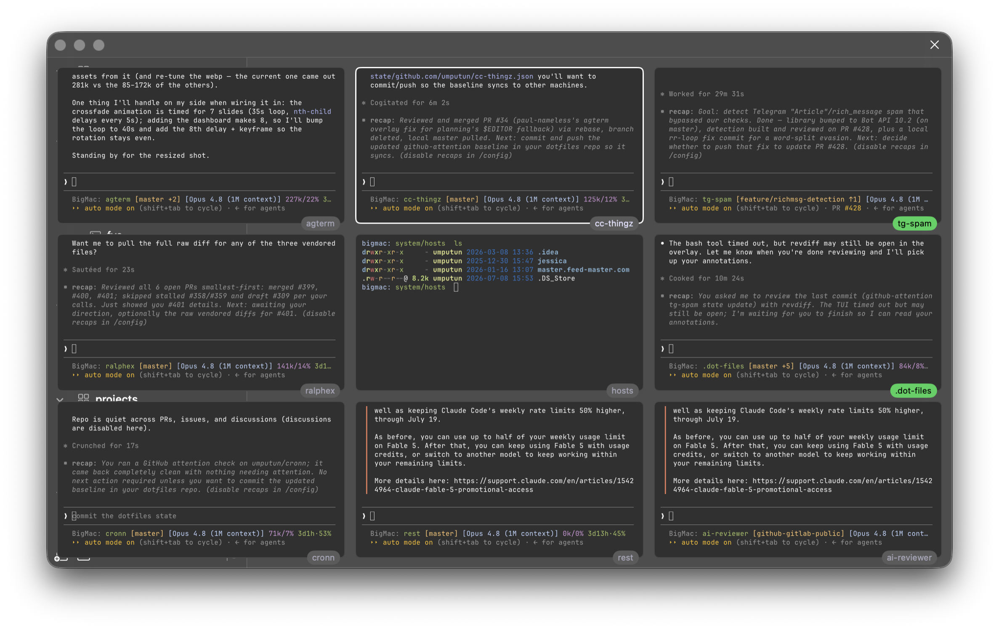
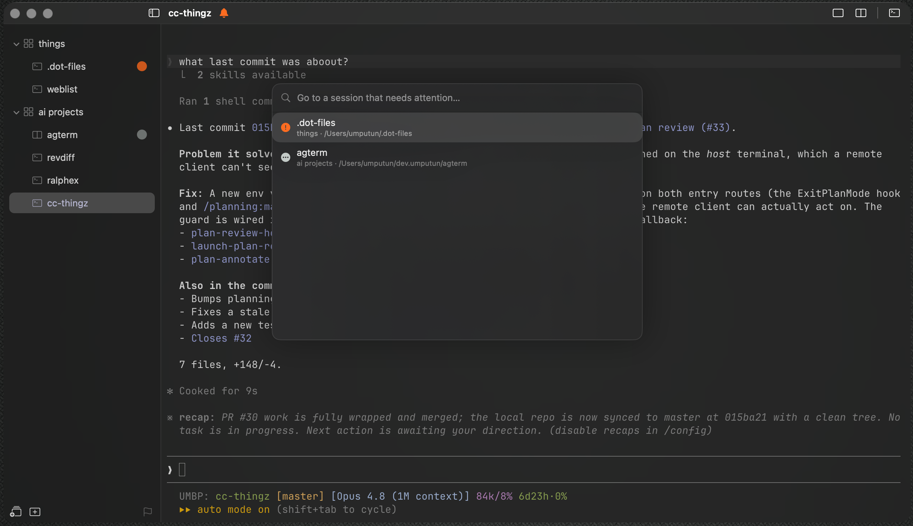
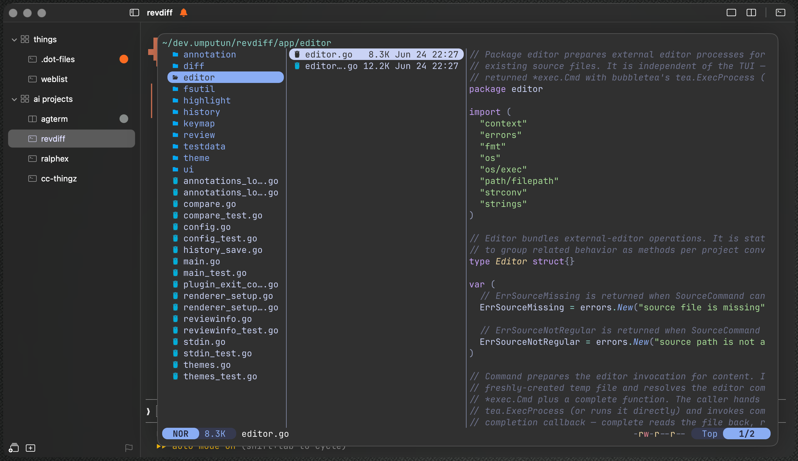
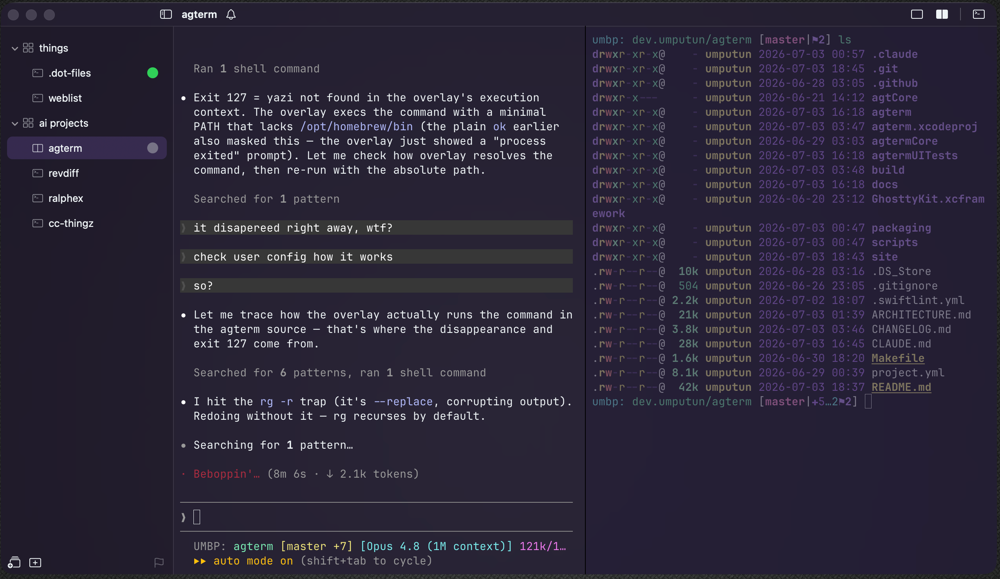

# agterm - modern terminal for agentic flow

[](https://github.com/umputun/agterm/actions) [](https://coveralls.io/github/umputun/agterm?branch=master)

**[agterm.com](https://agterm.com)** · [Documentation](https://agterm.com/docs) · [Command reference](https://agterm.com/commands) · [Cookbook](cookbook/)

`agterm` is a native macOS terminal for working with AI coding agents across many sessions at once. It is intentionally opinionated: rather than scattering shells across tabs, it organizes them into named workspaces, each holding the sessions for one project or context, so several agent-driven sessions can run side by side and you can move between them without losing track of which is which. The motivation is specific: running several coding agents at once means many long-lived sessions, each progressing on its own, and a tabbed terminal loses track of them quickly. agterm keeps them organized and makes it obvious which session needs you. None of this is limited to agents. It also works as a capable general-purpose terminal for everyday multi-project work.

The design is deliberately minimal: it covers the use cases above and stops there. Features come in two kinds. One is just enough to get the work done. The other is the small set of things other terminals get wrong, done the way they should have been. There is no deep agent integration and no attempt to invent a new way of working with agents. You get a sensible minimum out of the box, plus a complete control API and CLI on top. Almost everything is scriptable, so anything past the defaults you build yourself instead of waiting for it to ship.

What it does:

- **Workspaces.** Sessions are grouped under named workspaces like "work" and "personal", which keeps a screen of concurrent sessions organized. You reach a session by name, by recency, or from the keyboard.
- **Control API and CLI.** A bundled tool, `agtermctl`, drives almost everything over a local socket: create sessions, type into them, run a program in an overlay and read its exit status, move and resize windows, or post a notification tied to a specific session. A script or an agent can set up and drive its own layout, and send you a notification from the session it was working in.
- **Splits, scratch, and overlays.** Split a session into two shells, open a scratch terminal over it, or run a program in a full or floating overlay without disturbing the shell underneath.
- **Agent skill.** An installable skill (Help ▸ Install Agent Skill…) teaches Claude Code or Codex the control model and the `agtermctl` commands, so an agent running inside agterm can build its own layout, run overlays, manage windows, and show images inline without you explaining the API.
- **Agent status.** A coding agent reports its state (active, blocked, or completed) onto its session's row, so you can see which of many running agents needs you. Status hooks for Claude Code, Codex, Pi, OpenCode, and other agents install from Help ▸ Install Agent Status Hooks….

For the real terminal work, rendering, VT parsing, and shell I/O, `agterm` embeds [Ghostty](https://ghostty.org)'s engine (libghostty); everything above is `agterm`'s own.


<details>
<summary>More screenshots</summary>

The dashboard: several sessions' live output in one view-only grid, watched at once. A single click drops into any of them:



An agent's interactive prompt mid-session, with attention glyphs on the sessions that need you:


The attention list, collecting every session that needs you, sorted blocked then active then completed:



A split session (agent and shell side by side) with the action palette open:


A full-screen diff TUI running inside a session:


A file manager in a floating overlay over the active session:



The fuzzy session palette for jumping to any session by name:


A session's right-click context menu:


The keymap editor:


A split session, two panes side by side on different color themes:



A file open in the quick terminal, the window's shared scratch overlay:


</details>

## Install

Pre-built releases are for **Apple Silicon (arm64) Macs running macOS 14 or later**.

Releases are signed with a Developer ID certificate and notarized by Apple, so macOS Gatekeeper opens them with no extra steps.

Homebrew:

```sh
brew install --cask umputun/apps/agterm
```

The cask also installs the `agtermctl` command-line tool, so cask users should not run the in-app installer as well.

Direct download:

Download the latest `.dmg` from the [releases page](https://github.com/umputun/agterm/releases), open it, and drag `agterm.app` into `/Applications`.

### Optional Help-menu installers

The app's **Help** menu has three one-time installers. None are needed to use agterm as a terminal; each connects it to a wider workflow, and you can run any of them later. The first launch on a machine points them out in a welcome dialog, which offers the skill and the status hooks and never appears again.

- **Install Command Line Tool…** puts the bundled `agtermctl` on your `PATH` (a symlink in `/usr/local/bin`) so you can script the app from a shell. The Homebrew cask already installs it, so cask users can skip this one. See [Scripting agterm](#scripting-agterm).
- **Install Agent Status Hooks…** lets a coding agent (Claude Code, Codex, Pi, OpenCode, or others) report its state onto its session's sidebar row, so you can tell at a glance which of several running agents is active, blocked, or finished. See [Agent status](#agent-status).
- **Install Agent Skill…** teaches Claude Code or Codex how to drive agterm through `agtermctl`, so an agent running inside a session can build its own layout, run overlays, and manage windows without you explaining the API. It drives the app through the command-line tool, so install that one too.

## Build from source

<details>
<summary>Build steps</summary>

Requirements:

- macOS 14 or later.
- Xcode 26 with `xcodegen` on `PATH`, plus its Metal Toolchain (auto-downloaded on first setup).
- Homebrew, for the `zig@0.15` formula `scripts/setup.sh` builds libghostty with.
- Node.js 22.7+ (or 20.19+ on the 20.x line) on `PATH` for the OpenCode status-plugin unit tests (`OpenCodeStatusHookTests` spawns it; those versions unflag module-syntax detection for the plugin's bare `.js`). The app itself does not need Node at runtime; without a qualifying Node those tests skip.

```sh
scripts/setup.sh   # build libghostty from ghostty source + stage resources (idempotent; first run takes a few min)
scripts/run.sh     # setup, generate the Xcode project, build Debug, launch
```

A `Makefile` wraps these as a convenience front door: `make run` (build Debug + launch), `make build` (Debug, no launch), `make release` (Release build), `make deploy` (Release build + copy to `~/Applications`), `make test`, and `make dist VERSION=x.y.z` (release DMG — signed + notarized when a Developer ID cert is present, otherwise ad-hoc). Run `make` with no target to list them.

`scripts/build.sh` produces a Release build without launching. The unit tests run independently of Xcode and libghostty:

```sh
cd agtermCore && swift test
```

`scripts/test.sh` is a wrapper for the same command. UI behavior (rename, close, move, drag, add-session) is covered by XCUITests in `agtermUITests/` that drive the running app through the accessibility API:

```sh
xcodebuild test -project agterm.xcodeproj -scheme agterm -destination 'platform=macOS'
```

</details>

## Concepts

agterm arranges terminals into a small hierarchy. These are the only terms you need; the sidebar, menus, and shortcuts all map onto them.

**Session.** A session is one running shell with a name, a working directory, and its own scrollback. It is the unit you work in and the row you see in the sidebar. A new session takes its name from the basename of its directory; rename it to pin a custom name, clear the name to go back to the basename. New sessions open in your home directory by default, or in the current session's directory, or in a fixed folder (set in Settings). A session runs until you close it or its shell exits, and it comes back on the next launch with its directory, font size, and split state restored.

**Panes.** A session can split into two shells side by side. Both panes are part of the same session and share one sidebar row; a split is one session with two terminals, not two sessions. One pane is focused at a time, and the divider position is remembered — drag the divider to resize the panes, double-click it to snap back to an even split.

**Scratch terminal.** Every session has an extra shell, the scratch terminal, that you toggle on over the session and hide again without killing it. It opens in the session's directory and is for a quick aside next to your main work. It belongs to that one session and is not restored across launches. While it covers the session, ⌘D and the split button hide it rather than rearrange the panes beneath, so either one takes you back to the panes exactly as you left them.

**Quick terminal.** The quick terminal is a single throwaway shell per window, not tied to any session. It drops over whatever session is active, for a command unrelated to what you are working on, and hiding it keeps the shell alive. It is not restored across launches.

**Overlay.** An overlay runs one program in a temporary terminal over a session and disappears when the program exits, leaving the session as it was. It is mostly driven from the control API to launch an interactive program (a diff viewer, a process monitor) over a session without replacing its shell. It can cover the whole session, or just one split pane while the sibling pane stays live. The same slot also holds a **HUD**, a small passive panel carrying a message instead of a program, which leaves the session focused and typable underneath. The HUD is control-only; overlays are mostly control-driven, though Edit Keymap… and Edit ghostty.conf… open one too. See [Scripting agterm](#scripting-agterm).

**Terminal zoom.** Zoom fills the whole window with one terminal surface — a pane, the scratch, an overlay, or the quick terminal — hiding the sidebar and collapsing the title bar to a slim strip that keeps the traffic lights, the window title, and an exit button. Cmd+Shift+Return toggles it on the active surface (rebindable as `toggle_terminal_zoom`; the exit button, ⌘W, and View ▸ Toggle Terminal Zoom all leave it). It is a view mode, not a layout change: entering closes transient chrome (an open palette or search), and exiting restores split ratios, focus, and visibility exactly as they were. Everything else keeps running behind the zoomed surface, and a script can zoom any surface by id with `agtermctl surface zoom`. Distinct from macOS window zoom and full screen, which size the window itself.

**Dashboard.** For watching several agents or builds at once, the dashboard shows sessions' live output side by side in a grid (laid out `ceil(sqrt(n))`), overlaid on the window. The cell unit is a session+pane: a non-split session is one cell, and a split session shows as two cells — its left/primary and right/split panes. Each cell's name chip also reflects the session's agent status, filling with the status color and pulsing while it blinks, unless macOS Reduce Motion is enabled; the status color and text remain visible without the repeating animation. It is view-only — no cell's terminal takes input; the keyboard navigates a highlight between cells with the arrow keys, Enter (or a single mouse click on a cell) jumps into that session and focuses that exact pane (and closes the grid), and Esc closes it. It is opened over the control channel with `agtermctl dashboard <ids…>` — or with `agtermctl dashboard --mru` to fill the grid from the window's most-recently-used sessions instead of naming ids — and closed with `--close` (or Enter/Esc). An id may name one pane instead of the whole session by carrying a `:left`/`:right` suffix, the same form `tree --json` reports in `dashboardMembers`: `agtermctl dashboard "$a:left" "$b:right"` grids the main pane of one split session beside the split pane of another, leaving the panes you did not ask for out of the nine-cell budget. A bare id still takes every pane of its session. A `:right` on a session with no split names no pane, so it joins the unresolved note, and fails the command outright if nothing else resolved. The most-recently-used grid also has a built-in opener: **⌘⇧D** (or **Navigate ▸ Dashboard**, the command palette's **Dashboard**, or the title-bar grid button) toggles it, auto-sized, so the recent-sessions view is one keystroke away without a script. Cell fonts can be sized absolutely with `--font-size` or scaled to the grid with `--auto-size`; the nine-cell cap counts panes, so a set whose panes exceed nine is capped with the drop reported, and `--window` picks a window (default frontmost). The dashboard and terminal zoom are mutually exclusive.

**Workspace.** A workspace is a named group of sessions for one project or context, for example "work" or "personal". Sessions belong to a workspace and can move between workspaces while still running, keeping their shell and scrollback. There is always at least one workspace.

**Window.** A window is a whole set of workspaces and sessions in its own on-screen macOS window, with its own sidebar. Each window has its own sessions, so "work" and "personal" can run as two separate windows at once, each with its own tree. You keep a library of windows and open one per on-screen window; the windows open at quit reopen on the next launch with their frames. Windows are also fully scriptable: `agtermctl window` can create, raise, move, resize, and minimize them, so a few lines of shell can give every window the same frame and park all but the one you are on, turning several windows into what feels like one that switches contents. Right-click agterm's Dock icon for New Session, New Window, Quick Terminal, Dashboard, recent sessions, and sessions needing attention. The Dock menu is scoped to the last-active window: its lists and actions stay tied to that window even if another window comes forward while the menu is open. New Window is the exception — a new window belongs to no existing one, so it stays available whatever the last-active window is doing.

**Flagging and focus.** Two ways to cut down a busy sidebar. Flag a few sessions from different workspaces to get a flat working-set view of just those; a flag is durable and survives a move. Focus a set of workspaces to hide the rest, with a one-click way back. **Focus** in a workspace row's context menu zooms to that one workspace, and **Add to Focus** marks it alongside whatever is already marked — marking alone never narrows the tree, so a working set is built row by row with everything still on screen and applied once with the grid button at the bottom of the sidebar. A marked workspace row draws a heavier grid icon; the button applies or suspends the filter without losing the set, and is disabled when nothing is marked. Creating a workspace while the filter is on adds it to the set, and selecting a session outside the set suspends the filter rather than discarding it — in the workspace tree; in the flagged view the filter stays applied and takes effect again when you switch back. The reverse holds too: if narrowing the sidebar would hide the session you are working in, agterm moves you to the most recent session still on screen, unless the narrowing leaves nothing visible at all. The set is per-window and remembered across restarts. The two are independent.

Sidebar session rows support Shift-click range selection and Cmd-click toggling for batch work. Right-clicking inside a multi-selection keeps the batch for Flag/Unflag, Close, and Move to; right-clicking outside narrows to the clicked row. Dragging from a selected row moves the selected sessions as one ordered block. **Duplicate Session** — in a single session's context menu, right after Rename — opens a fresh session in the same workspace, right after that one, in its current directory (a plain new shell: only the directory carries over, nothing else about the session does).

**Finder integration.** In the tree view, drag folders from Finder onto a workspace or session row to open one session per folder there; drop on empty sidebar space to use the current workspace, or the focused one when the filter is applied to exactly one workspace (the only case where the tree shows a single unambiguous target). Collapsed workspaces spring open while you hover and close again if you cancel. Dropping more than 20 folders at once is rejected. **Reveal in Finder** in the session context menu or main menu selects the focused pane's current directory (and is disabled if that directory no longer exists). Folder-picking panels also start in the focused pane's directory when it is available.

**Notifications.** A program in any session can raise a desktop notification (via OSC 9 / 777, or the control API). It shows as a banner and a count badge on the session's row; clicking the banner jumps to the exact pane that raised it. When agterm is in the background, an opt-in setting can bounce its Dock icon once, or keep it bouncing until you focus agterm (off by default). An optional notification sound (default None) attaches a system sound to each delivered banner — say, an agent finishing a turn in a background session; it rides the banner, so it follows the banner toggle and is silenced by Do Not Disturb. The badge clears when you visit the session, or headlessly with `agtermctl session seen` — so an orchestrator driving a session over the socket can acknowledge its notifications without pulling focus to it (`agtermctl tree --json` reports each session's `unseen` count). For a coding agent that just needs to say it is waiting on you, [Agent status](#agent-status) is usually the better fit.

**Agent status.** A coding agent in a session can report its state (active, blocked, completed) onto that session's row, so a screen of concurrent agents shows which one needs you. See [Agent status](#agent-status) for wiring it up.

## Keyboard and navigation

agterm is built to run from the keyboard. Every action has a shortcut and appears in the menus, and three fuzzy palettes cover the rest (type to filter, Enter to run, Esc to dismiss):

- the **session switcher** (Ctrl-P) jumps to any open session by name or working directory;
- the **action palette** (Ctrl-Shift-P) runs any command by name (new, rename, close, split, toggle scratch, move a session, change font size, and so on);
- the **custom-commands palette** (Ctrl-Shift-O) lists the shell commands you define in `keymap.conf`.

For jumping back to sessions you have been working in, a Ctrl-Tab switcher walks a most-recently-used list across every workspace, macOS app-switcher style: hold Ctrl and tap Tab to move through it, release to switch, and a single tap flips straight back to the session you were just in. The list survives a relaunch, so the switcher works right after your sessions restore. A title-bar clock button opens the same list for the mouse: a popover of the sessions you have used recently, tinted to the terminal theme, that you hover to highlight and click to switch to. Shortcuts also step between adjacent sessions, panes, and windows.

The same recently-used history decides where you land when you close the session you are in: agterm returns you to the session you were most recently working in, not to whichever row happens to sit next to the one that closed. The pick stays inside the closing session's workspace, and in the flagged view stays within the flagged set, while in the tree with the workspace filter applied it stays within the marked workspaces — widening beyond the workspace only when the close leaves nothing there to return to, and beyond what is on screen only when that too is exhausted. If no recent session qualifies at all, it falls back to the adjacent row, kept inside the narrowed view while one is applied, and to the first session of another workspace when the closed session was the last one in its own.

## Accessibility

Voice dictation tools that probe for a focused text field — the system Dictation, MacWhisper, and similar assistive apps — now engage over the terminal: the on-screen pane advertises itself to the accessibility system as an editable text area, so a hold-to-dictate widget anchors to it and dictated text lands at the prompt. Text arrives at the cursor the same way typing does, and an insert carrying a newline, a tab, or any other control character goes in as a bracketed paste, so a program that accepts bracketed paste takes it as literal text instead of running the line or completing the word. That last part is the same caveat ⌘V carries: at a raw prompt with bracketed paste off, a trailing newline still submits and a tab still triggers completion.

Two limits are worth knowing. The scrollback is deliberately not mirrored, so the exposed pane reads to a screen reader as an empty text area named "Terminal" rather than as the terminal's contents — mirroring the grid is a separate, much larger piece of work. And because the terminal appends at the cursor with nothing to read back, a dictation tool that re-sends its whole transcription on every revision (rather than only the new words) will concatenate its drafts at the prompt; tools that insert incrementally, MacWhisper among them, are unaffected.

## Settings

Settings (Cmd+,) has six tabs. **General** covers mouse scroll speed and right-click-to-paste, whether clicking a workspace row expands or collapses it (on by default; the disclosure triangle toggles either way), where a new session opens, an opt-in toggle to re-run each pane's foreground command on restart, an opt-in confirmation before closing a session, and whether to load your global Ghostty config. **Appearance** sets the terminal font and theme (512 bundled themes), the toolbar mode, the window background opacity and blur, the sidebar tint, the sidebar font size, the palette and switcher font size, and how much the terminal behind a floating panel dims — the inactive half of a split, and the session left visible around a floating overlay or the quick terminal; a "Follow system appearance" toggle (off by default) reveals a second picker for the other appearance, so the theme tracks macOS light/dark mode live. With macOS Reduce Transparency enabled, agterm temporarily presents translucent windows, command palettes, and session switchers as opaque and unblurred without changing the saved opacity or blur; disabling it restores those settings. Reduce Motion keeps status colors and glyphs visible but suppresses their repeating sidebar and dashboard pulses. The toolbar has three modes: **Normal** shows the title with the working directory beneath it, **Compact** (the default) is a single title row, and **Hidden** drops the whole titlebar row and the window's traffic-light buttons for a full-bleed terminal with no chrome — an invisible strip along the top edge still moves the window and double-click-zooms it, and you close, minimize, or zoom the window from the keyboard or the Window menu. **Interface** turns individual chrome controls on or off, each shown by default: in the title bar the sidebar toggle, the session name, the window name, and the recent-sessions, scratch, split, dashboard, and quick-terminal buttons; in the sidebar the new-workspace, new-session, flagged-view, and workspace-filter footer buttons plus the per-workspace add-session "+" revealed on hover — so you can pare the chrome down to just what you use (the actions stay available from the menus, keyboard, and control channel). A **Multiple Windows** option (off by default) shows the sidebar only in the frontmost window and collapses it on every other, so with several windows open only the one you are working in carries a sidebar; switching windows moves the sidebar with focus, and switching to another app leaves every sidebar as it was. **Notifications** covers the banner, the unseen-count badge, the Dock-icon bounce for a background notification (off, once, or until you focus agterm), the notification sound (a system sound played when a notification is delivered; None by default), and the title-bar attention indicator. **Agent Status** sets the status-glyph colors and shapes, the blocked-session sound, and an idle timeout to auto-follow blocked sessions. **Key Mapping** points at the directory holding `keymap.conf`, lists any parse errors, and reloads it. Changes apply live to the open terminals.

The theme picker (View ▸ Select Theme…, or the action palette) previews each bundled theme on the open terminals as you move through the list, so you see it before committing. Enter commits and syncs it to Settings; Esc reverts to the one you started on. While following the system appearance, the picker edits the theme for the appearance you are in; the control channel drives both slots with `agtermctl theme set --light NAME --dark NAME` (or either flag alone).

## Scripting agterm

`agterm` can be driven from a script over a local unix-domain socket through a companion CLI, `agtermctl`. This is for personal scripting: commands manage workspaces and sessions, inject text, invoke control actions, and subscribe to control events. Terminal output is not streamed; use `session text` when a script needs to read a terminal buffer.

To open a terminal at a directory without the CLI, `open -a agterm <path>` — or right-click a folder in Finder and choose **Open With ▸ agterm**. agterm adds a session in that directory to the last-active window. This works when agterm is already running (its usual state); if it isn't, launch agterm first, then run the command. The socket equivalent, and the way to place the session precisely, is `agtermctl session new --cwd <path>`.

The sections below cover the common cases. All 74 commands, with every argument, return value, and error, are documented in the **[Command reference](https://agterm.com/commands)**.

The app bundles `agtermctl` inside `agterm.app`. The easiest way to put it on your PATH is **Help ▸ Install Command Line Tool…**, which symlinks the bundled binary into `/usr/local/bin` (the first entry in macOS's default PATH). When that directory is user-writable it installs silently; otherwise it asks once for an administrator password.

To let a coding agent drive agterm without you explaining the API, install the bundled agent skill with **Help ▸ Install Agent Skill…**. Claude Code and Codex share the same skill format, so it installs to whichever you have, `~/.claude/skills/agterm/` and/or `~/.codex/skills/agterm/`. The skill teaches the agent the control model and the full `agtermctl` command set, so an agent running inside agterm can create sessions, run overlays, manage windows, and reload the keymap on its own. It drives the app through `agtermctl`, so install the CLI too.

The same skill is also published as a plugin from this repository, which is the better route if you keep your agent's config somewhere other than `~/.claude` or `~/.codex` — the agent does the installing, so the skill lands wherever that agent actually looks, and updates through the agent's own plugin commands:

```sh
# Claude Code
claude plugin marketplace add umputun/agterm
claude plugin install agterm@agterm

# Codex
codex plugin marketplace add umputun/agterm
codex plugin add agterm@agterm
```

Use one route or the other, not both — a machine with both ends up with two copies of the skill, and which one the agent picks is not defined. Adding the marketplace clones this whole repository, which is an app rather than a skill library; both CLIs take a `--sparse` option on `marketplace add` to limit the checkout, and it needs to cover the marketplace manifest as well as `plugins/agterm`.

`agtermctl` also lives in the `agtermCore` Swift package and builds standalone without Xcode or libghostty:

```sh
cd agtermCore && swift build -c release
# the binary is at agtermCore/.build/release/agtermctl
```

Each command targets a session or workspace by its UUID, a unique prefix of that UUID (git-style), or the keyword `active` (the selected session / current workspace). `--target` defaults to `active`, so the current one rarely needs to be named. Mutating commands normally print the affected id; batch `session close` and `session move` accept repeated `--target` options and print the number of sessions actually changed. `tree` prints the workspace and session tree. Add `--json` for the raw response, or `--socket PATH` to override the socket path. The exit code is zero on success, non-zero on error.

### Native picker

`agtermctl pick` reads choices from stdin and opens agterm's native fuzzy picker.
Input can be nonblank lines or a JSON array of objects with `id`, `label`, and an optional `subtitle`.
The default call blocks and prints terminal-result JSON: picked item, custom query, or cancellation.
Use `--allow-custom` to accept a query that does not match an item, `--window` to target another open window, and `--follow` to raise that window.
Typing matches item labels only; a subtitle is shown but never searched, so consequence text on one row cannot filter out its safer neighbour.
An empty query lists the items in the order they were supplied, so the caller's first item is the one Return runs on open.
`--query TEXT` prefills the field and filters immediately, which ranks by match score and therefore does not preserve that supplied order.
With `--allow-custom` the item list may be empty, which turns the picker into a plain text prompt: the custom row appears as soon as the query is nonblank, whether prefilled by `--query` or typed.
An itemless call still reads stdin, so redirect it (`< /dev/null`) or it blocks.

```sh
printf '%s\n' staging production | agtermctl pick --prompt "Deploy where?"

agtermctl pick --allow-custom --query "$name" --prompt "Rename to" < /dev/null

pick_id=$(printf '%s\n' alpha beta | agtermctl pick --no-block | jq -r '.id')
agtermctl pick result "$pick_id"      # bare JSON result; exit 1 while pending, 2 when cancelled
agtermctl pick cancel "$pick_id"
agtermctl tree --json | jq -r '.result.tree.pickPending // empty'
```

Only one picker can be pending per window.
The top-level `pickPending` tree field carries its id and is omitted after it resolves.

### Control events

`agtermctl events` continuously prints app control events. It subscribes from the current tail, so events that happened before the command started are not replayed. Human output is concise; `--json` writes one bare JSON event per line and flushes it promptly for pipelines:

```sh
agtermctl events
agtermctl events --json --kind status --kind notify
agtermctl events --json --kind session.created,session.closed --limit 250
```

The event kinds are `status`, `notify`, `session.created`, `session.closed`, and `tree.changed`. Every event has an app-wide `seq`, a Unix `ts`, its `kind`, applicable `window`/`workspace`/`session` ids, and a kind-specific `payload`. Status payloads carry the session name, normalized status including explicit `idle` clears, a `blink` boolean, and optional pane, color and shape fields. Notification payloads carry the effective title and body. Session lifecycle payloads carry the session name. `tree.changed` is a 100 ms coalesced signal that a window's workspace/session names, membership, or ordering changed; read `tree --json` for the new snapshot.

The app retains the latest 4,096 events for its current process run. A raw `events.read` request with no cursor returns an empty batch whose `run` and `next` fields anchor a subscribe-from-now cursor. Resume with the pair using `agtermctl events --run RUN --after NEXT`; both options are required together. `--kind` may be repeated or comma-separated, `--limit` defaults to 100 and accepts 1 through 1,000, and filtered reads still advance the global cursor past nonmatching events. The streaming CLI polls immediately while draining events and waits 250 ms only after an empty page.

The `--json` stream contains bare event objects, not the batch envelope, so a client that needs restart-safe resume must save `run` and `next` from raw `events.read` responses. A changed app run, expired cursor, or cursor ahead of the current sequence is a hard error with the current anchor in the raw response. `agtermctl events` exits non-zero for these cursor errors, server errors, or a missing app/socket; it never silently starts over. Stop a healthy stream with the usual SIGINT or SIGTERM behavior.

`--workspace`/`--target` take an id, a unique id prefix, or `active` — never a name. (`session new` also accepts `--workspace-name <name>` to target a workspace by its sidebar label, plus `--create-workspace` to make it when none matches — the two are mutually exclusive with `--workspace`.) For workspaces, `active` is the one a new session lands in: a workspace you just created in the foreground, otherwise the selected session's, otherwise the last one. A newly created workspace stays the target until the selection moves to a DIFFERENT session, so New Session (and `session new`) right after creating one lands in the new workspace rather than the one you came from. Closing the last session clears the selection and ends it too, as do deleting the new workspace and hiding it behind the workspace filter — the filter permanently, so turning it off does not bring the target with it. `workspace select` moves the target to the workspace you name, including an empty one, where taking the target is the only thing it can do. Reselecting the session you are already on changes nothing: `session select`, `overlay open --follow` and single-session navigation all leave the target where it is. To create a workspace and then open a session in it, capture the printed id:

```sh
agtermctl tree                                   # print the workspace/session tree with ids
ws=$(agtermctl workspace new work)               # create a workspace, capture its id
agtermctl session new --workspace "$ws" --cwd ~/src/agterm  # open a session in it, print its id
agtermctl session new --command "ssh user@host"  # run a command as the session's process (like kitty launch; no typed command, closes on exit)
agtermctl session new --command "sh -c 'clear; ssh user@host'"  # --command is argv-style (no shell); wrap in sh -c for ;, $VAR, redirects
agtermctl session new --command "zsh -lc 'make test'" --wait  # hold the session open after the command exits (press any key to close) so its final output stays readable; --wait needs --command
agtermctl session new --name "myhost" --command "ssh user@host"  # pre-name the session (sidebar label set at creation)
agtermctl session new --workspace-name servers --create-workspace --name "myhost"  # open in the "servers" workspace, creating it if absent (idempotent)
agtermctl session new --after active             # create right after the current session (--before to precede it); the anchor's workspace is used
agtermctl session new --cwd ~/src/agterm --no-select  # create in the background without switching to it (the current session stays active)
agtermctl session duplicate --target 9f3c        # a second plain shell in that session's workspace and cwd, right after it (only the directory carries over)
agtermctl session type --target 9f3c $'make test\n'      # inject text into a session by id prefix
echo 'make test' | agtermctl session type --target active --stdin
agtermctl session go --to next                   # step to the next session (next|prev|first|last; wraps at the ends, within the visible set)
agtermctl session move --to up                   # reorder the active session within its workspace (up|down|top|bottom)
agtermctl session move "$ws"                      # relocate the active session to another workspace (appends)
agtermctl session move --after 9f3c              # place the active session right after another (--before to precede it); relocates cross-workspace if the anchor lives elsewhere
agtermctl session move "$ws" --target 9f3c --target abcd  # move a batch as one ordered block; --after/--before also accept repeated --target
agtermctl session close --target 9f3c --target abcd       # close a batch with one grace-period undo
agtermctl workspace move --to top                # reorder a workspace among its siblings (up|down|top|bottom)
agtermctl workspace new work --collapsed          # create a workspace closed in the sidebar (fill it with session new --no-select without it opening)
agtermctl workspace collapse --target "$ws"       # collapse one workspace in the sidebar tree; workspace expand re-opens it (per-workspace, unlike sidebar expand/collapse)
agtermctl session split toggle                   # split the active session
agtermctl session resize --split-ratio 0.7       # set the split divider (left-pane fraction); or --grow-left/--grow-right D
agtermctl session scratch toggle                 # show/hide the active session's scratch terminal (on|off|toggle)
agtermctl session flag on                        # flag the active session for the flagged working-set view (on|off|toggle|clear)
agtermctl session reveal --target 9f3c           # reveal the focused pane's cwd in Finder
agtermctl session seen --target 9f3c             # clear a session's unseen-notification badge without visiting it (focus-free)
agtermctl sidebar mode flagged                   # show only the flagged sessions as a flat list (tree|flagged|toggle)
agtermctl workspace focus on                     # mark the active workspace alone and apply the sidebar focus filter (on|off|toggle|add)
agtermctl workspace focus add --target a1b2      # mark another workspace too; add never narrows the tree on its own
agtermctl workspace filter on                    # apply the marked set (on|off|toggle); filter off suspends it without losing the set
agtermctl session search "error"                 # open the search bar and highlight matches; prints the "N of M" counter
agtermctl session search --next                  # step to the next match (--prev steps back, --close hides the bar)
agtermctl quick toggle                           # toggle the quick terminal (show|hide|toggle)
agtermctl quick type 'ls -la'$'\n'               # type into the frontmost window's quick terminal (or --stdin); quick text reads it back
agtermctl surface zoom                           # fill the window with the active terminal surface (show|hide|toggle)
agtermctl surface zoom show --target "surface:$AGTERM_SESSION_ID:right"  # zoom a specific surface by id (ids in tree --json)
agtermctl dashboard "$a" "$b" "$c" --auto-size   # view-only grid; a split session is two cells, capped at 9 panes (--font-size N | --auto-size; --close)
agtermctl dashboard "$a:left" "$b:right"         # ...or name one pane per session (:left|:right); a bare id still takes both
agtermctl dashboard --mru --auto-size            # ...or fill it from the window's most-recently-used sessions (no ids)
agtermctl font inc                               # increase the session's (main pane's) font size
agtermctl font dec --pane right                   # shrink just the split pane's font (--pane left|right|scratch)
agtermctl theme set --light "Builtin Light" --dark Dracula  # set the light/dark theme slots (--dark none turns following off)
```

`session type` types the text as real keystrokes, and every newline is a real Return press — so a trailing newline submits the command, and a multi-line payload runs line by line (a multi-line shell construct like a `for` loop is entered across the shell's continuation prompts and runs as one command). Note the `$'…\n'` quoting: a literal `\n` inside plain single quotes reaches the CLI as two characters, not a newline; use `$'…\n'` or pipe a real newline via `--stdin`. Typing goes to the session's left (main) pane by default; `--pane right` types into the split pane instead (an error when the session has no split), and `--pane scratch` reaches the session's scratch terminal even while it is hidden. `session text` takes the same `--pane`, so an agent can read a hidden scratch's output (e.g. a deploy you ran there) without leaving it open. `font inc|dec|reset` also takes `--pane left|right|scratch`, so you can resize just the split pane's font (an error when there is no split); only the main pane's size is remembered across a restart.

`session copy` returns the target session's selected text in the response (it does not touch the system clipboard), so a script can move a selection from one session to another:

```sh
sel=$(agtermctl session copy --target 9f3c)      # the selected text in session 9f3c
agtermctl session type --target work --select "$sel"  # paste it into another session
```

With no selection it exits non-zero with `no selection`. The selection must be made in the terminal (drag/Shift-click); `session copy` only reads it.

`session paste` pastes the system clipboard into a session (the socket analogue of ⌘V), and `session select-all` selects the session's entire buffer (the analogue of ⌘A) — pair `select-all` with `copy` to grab the whole buffer:

```sh
printf 'deploy staging' | pbcopy
agtermctl session paste --target work            # lands at the prompt, not submitted
agtermctl session select-all --target 9f3c       # then read it all back
agtermctl session copy --target 9f3c
```

These are also the Edit menu's Copy/Paste/Select All (⌘C/⌘V/⌘A), which act on the focused terminal (or a focused text field).

`session overlay open` runs a program in an ephemeral terminal on top of a session (full size, hiding the single/split content underneath). It is meant for launching an interactive program over a session — the overlay grabs focus, and when the program exits the overlay vanishes and the session reappears unchanged:

```sh
agtermctl session overlay open "revdiff HEAD~3" --target 9f3c  # review the last 3 commits over session 9f3c
agtermctl session overlay open "htop"                          # on the active session
agtermctl session overlay open "htop" --size-percent 70        # a floating, framed panel at 70% of the pane
agtermctl session overlay open "revdiff HEAD~3" --size-percent 80 --background-color "#2a1a3a"  # tint the overlay pane
agtermctl session overlay open "revdiff HEAD~3" --target 9f3c --follow  # switch the user to session 9f3c as the overlay opens
agtermctl session overlay open "make test" --wait              # keep the overlay open after exit (press a key to close)
agtermctl session overlay open "make test" --block             # block until it exits; exit with its status
agtermctl session overlay resize --size-percent 60 --target 9f3c  # resize an open overlay to a floating 60% panel
agtermctl session overlay resize --full --target 9f3c          # switch it back to the full-pane overlay
agtermctl session overlay close --target 9f3c                  # close it from a script
agtermctl session overlay open "revdiff HEAD~3" --target 9f3c --pane right  # cover only the split pane
```

By default an overlay opens on its `--target` without switching the active session — full and floating both run their program in the background and appear when the user visits that session; pass `--follow` to select the target as the overlay opens (a no-op if it is already active). `session overlay resize` changes an already-open overlay in place — `--size-percent N` (1–100) makes it a floating panel, `--full` switches it back to full size — and the program keeps running across the change. By default it closes the instant the program exits; `--wait` keeps it on a "press any key to close" prompt so you can read the program's final output. A `*` `(overlay)` tag in `agtermctl tree` marks a session whose overlay is open.

`--block` runs the program in the overlay (rendering normally) and blocks until it exits, then exits with the program's status — useful in a script that needs the outcome of an interactive run. The program's output stays its own concern: a TUI writes its result to its own file (for example `revdiff --output=…`) which the script reads, while `--block` reports only the exit status (the overlay never captures stdout). `--block` can't be combined with `--wait`; `session overlay result` reports the last overlay's exit status on demand for a manual open → poll flow.

`--pane left|right` scopes the overlay to one split pane instead of the whole session: it covers exactly that pane and leaves the sibling pane visible and interactive, so an agent working in the split can show a diff or a TUI over its own pane without blanking the one you are reading. The two panes are independent and may both hold an overlay at once, each with its own background color. A pane overlay is always full-pane — there is no floating variant, so `--pane` cannot combine with `--size-percent` and `session overlay resize` takes no `--pane` — and everything else matches the session-wide overlay, including `--wait`, `--block`, `--cwd`, and `--follow`. A non-split session accepts `--pane left`, since its shell reports `AGTERM_PANE=left`, so a script can pass `--pane "$AGTERM_PANE"` without checking whether the session is split. A pane that is not on screen is refused with `pane not visible`: a shown split renders both panes, but a hidden one renders only the focused pane, so the refused one is the pane you are not in — `--pane left` while the hidden split holds the focus, `--pane right` while the main pane does. Hiding the split after opening is fine, the program keeps running and reappears when the split comes back. `session overlay close` and `session overlay result` take the same `--pane`, ⌘W dismisses the focused pane's overlay before it would close the session (one on the other pane is not in front of you, so ⌘W keeps its ordinary meaning), and `agtermctl tree --json` reports the covered panes as `paneOverlays`.

By default the overlay fills the pane, drawn translucent, hiding the session beneath it. Pass `--size-percent N` (1–100) for a *floating* variant instead: an opaque, framed panel sized to N% of the pane in both dimensions and centered in it, with the session still visible around it. Useful for a small auxiliary program (a picker, a monitor) that you want floating over — not replacing — the terminal you're working in. It composes with `--block` (a blocking floating overlay). Like a full overlay it opens in the background and runs even when the target is not active; pass `--follow` to switch the user to the target as it opens.

`session hud` posts a message in that same slot instead of a program. It is passive: the session keeps focus and stays typable under the panel, the terminal behind it is neither dimmed nor click-blocked, and nothing is waiting for the user to answer. It exists for the seconds a script or an agent needs before it can show anything, so the session says what is happening rather than sitting silent:

```sh
agtermctl session hud "gathering options…" --spinner --detail "scanning branches" --target "$AGTERM_SESSION_ID"
agtermctl session hud update "ready" --detail "pick a branch" --target "$AGTERM_SESSION_ID"
agtermctl session hud "deploying" --position top --size-percent 30   # place it, set its width by hand
agtermctl session hud close --target "$AGTERM_SESSION_ID"
```

`open` is the default subcommand, so `session hud "…"` posts one. `--position top|center|bottom` places the panel vertically (default `center`; `top` and `bottom` hold a margin off the pane edge on their own), and the panel is sized from the message: its width by the longest line, its height by the number of them, so a title and a subtitle give a wide, short panel rather than a square one. `--size-percent` overrides the width only — a caller-set height could only strand the message in an empty box. Either way the panel is bounded to at most 80% of the pane — a message must never cover the session it is about, which is also why `session overlay resize --full` is refused against a HUD. `--spinner` animates a glyph beside the message in the default `bar` style, and `--spinner-style bar|braille|circle|blocks|dot` picks another and turns it on by itself — `dot` blinks rather than animating, for a panel that sits up for minutes, and `none` leaves the panel static, which is what the read-back reports for one. `session hud update` repaints in place with no re-spawn and no blink, and replaces the whole message, so `--detail` and the spinner have to be repeated to survive; `--background-color` is the exception, read once when the panel is created and kept — in the panel and in the read-back — across every update. Since it shares the overlay slot, a second `hud` replaces the first, `session overlay open` replaces a HUD, and ⌘W or `session overlay close` takes one down; a HUD over a *running* program is refused instead, because a message is replaceable and a program is not. `agtermctl tree --json` reports it as the session node's `hud` object with `overlay` reading false beside it, and there is no event, so a script that needs the state polls the tree.

Every session's terminal is mounted whether or not it has been shown, so `session type` reaches a background session without selecting it. A session created a moment ago is the one exception: its surface needs a layout pass before it can take input, so `session type` waits briefly for it rather than failing, and a script can create and type back to back. Pass `--select` to select the session first — it only moves your selection when the surface is not ready yet — and `session not realized` is left for a surface that never comes up:

```sh
id=$(agtermctl session new --cwd ~/src/agterm --no-select)
agtermctl session type --target "$id" $'echo hello\n'   # no focus change
```

`agtermctl window` drives the named windows. `window list` prints `id  name  [open]  [active]` (raw with `--json`); the other subcommands take a window id, a unique prefix, or `active` (the frontmost):

```sh
agtermctl window list                            # id  name  [open]  [active]
w=$(agtermctl window new work)                   # create and open a window, capture its id
agtermctl window new proj-b --minimized          # create one already parked in the Dock
agtermctl window select "$w"                     # raise it (opening it first if it was closed)
agtermctl window rename "$w" personal            # rename it
agtermctl window minimize "$w" on                # park it in the Dock (off restores, toggle flips)
agtermctl window close "$w"                      # close its on-screen window (the bundle is kept)
agtermctl window delete "$w"                     # delete it (the last window can't be deleted)
```

A global `--window <id>` option on the session, workspace, `tree`, and `font` commands targets a *specific* window's tree instead of the frontmost one (the window must be open). Without it, those commands act on the frontmost window:

```sh
agtermctl tree --window "$w"                              # the tree of window $w
agtermctl session new --window "$w" --cwd ~/src/agterm       # open a session in window $w
```

Inside a session's shell, `agterm` injects environment variables a script can read: `AGTERM_ENABLED=1`, `AGTERM_WINDOW_ID`, `AGTERM_WORKSPACE_ID`, `AGTERM_SESSION_ID`, `AGTERM_SOCKET` (the live control-socket path), `AGTERM_PANE` (which pane this shell runs in — `left` for the main pane, `right` for the split, or `scratch`; unset in an overlay), and `AGTERM_PANE_ID` (a stable per-surface token the agent-status hook forwards as `session status --pane-id`, so a status from a pane whose role went stale — a split survivor promoted into the main pane, then re-split — still resolves to the pane's current slot; `session restore --pane-id` takes the same token, except that there an unresolvable one is an error rather than a silent main-pane fallback, since it would otherwise pin the wrong pane's command). So a script running in a session can drive its own window without hard-coding ids:

```sh
agtermctl session new --window "$AGTERM_WINDOW_ID" --cwd .   # open a sibling session in this window
agtermctl session type --target "$AGTERM_SESSION_ID" $'\n'   # type into this very session
agtermctl tree --socket "$AGTERM_SOCKET"                     # reach the same agterm this shell runs in
```

## Cookbook

The [cookbook](cookbook/) collects complete `agtermctl` workflows, each in its own directory with a README and, where it needs one, its scripts: switching the sidebar to a single project, closing a project's workspaces and bringing them back later, picking a path with `fzf` and typing it into the shell, and giving each tab its own Claude Code or Codex conversation across a restart. They are written to be copied into your own setup and edited, not only read; [cookbook/CONTRIBUTING.md](cookbook/CONTRIBUTING.md) has the rules for adding one.

Recipes come from other people as well as the maintainer. Every one is reviewed before it is accepted, but they are shell scripts you run on your own machine against your own sessions, and several close sessions or delete workspaces, so read a recipe before you run it.

## Customizing keys

`agterm` reads a user-editable, kitty-flavored keymap file at `~/.config/agterm/keymap.conf`. It does two things: rebind the built-in menu shortcuts, and define custom shell commands bound to keys (and listed in the action palette). The file is optional — the app ships with working defaults, and a commented starter `keymap.conf` is written on first launch. The directory holding it can be changed in **Settings ▸ Key Mapping** (the field shows the active path, with a "Choose…" picker and "Use Default").

The format is line-based with two verbs. Blank lines and lines starting with `#` are ignored:

```
# rebind a built-in to a single chord (mods joined by +; no leader sequences for built-ins)
map cmd+shift+l   toggle_split
map ctrl+shift+k  command_palette

# define custom commands ("name" shows in the palette; chord is optional)
command "Open in Zed"  cmd+shift+e  open -a Zed {AGT_SESSION_PWD}
command "Lazygit"      ctrl+a>g     agtermctl session overlay open lazygit --socket {AGT_SOCKET}
command "Deploy"                    ./deploy.sh
```

A chord is modifier words joined by `+` and a base key, e.g. `cmd+shift+e` or `ctrl+\``. The modifiers are `ctrl`, `cmd`, `opt`, and `shift`. The base key is a single character or one of `tab`, `space`, `return`, `delete`, `left`, `right`, `up`, `down`. A key you type with Shift is written as `shift+<base key>` (the base key, not the shifted symbol): `shift+/` for `?`, `shift+5` for `%`, `shift+=` for `+`, `shift+.` for `>`. A custom command's chord may also be a leader sequence — chords separated by `>`, e.g. `ctrl+a>g` (press `ctrl+a`, then `g`). A `command` with no chord is palette-only. A custom command's chord must include a modifier: a bare key like `a` is rejected with a diagnostic and the line is treated as palette-only, so a binding can't silently shadow a plain terminal key. The same diagnostic appears when the shell line simply starts with a bare key name — a single character, or one of the named keys like `up` or `tab` — and the line is kept as palette-only with its shell command intact.

Chords are written in Latin and keep working on a non-Latin keyboard layout. A layout that cannot type ASCII — Russian, Greek, Hebrew, Arabic, Thai — resolves every chord by the physical key position, so `cmd+o` still fires on the key marked O even though it types `щ`. A layout that can type ASCII binds what it types, so an alternative Latin layout keeps its own letter positions: on Dvorak, `cmd+o` follows the O you actually type.

The bindable built-in action names are:

```
new_window         rename_window      delete_window
new_workspace      rename_workspace   delete_workspace
new_session        open_directory     rename_session     duplicate_session
close_session      reopen_recent      undo_close         clear_status
increase_font_size decrease_font_size reset_font_size
toggle_split       toggle_scratch     toggle_search
toggle_sidebar     toggle_flag        toggle_flagged_view
focus_left_pane    focus_right_pane   focus_workspace    toggle_workspace_filter
previous_session   next_session       first_session      last_session
previous_attention_session            next_attention_session
quick_terminal     session_palette    command_palette
custom_command_palette                show_attention
select_theme       toggle_fullscreen  toggle_terminal_zoom
dashboard
```

The shell line of a `command` may use these `{AGT_X}` tokens, expanded at fire time (the same values are also exported as `$AGT_X` environment variables on the spawned process):

```
{AGT_SESSION_ID}   {AGT_SESSION_NAME}   {AGT_SESSION_PWD}
{AGT_WORKSPACE_ID} {AGT_WORKSPACE_NAME}
{AGT_WINDOW_ID}    {AGT_WINDOW_NAME}
{AGT_PANE}         {AGT_SELECTION}      {AGT_SOCKET}
```

The context is resolved from the focused pane's session, so a custom command runs in that session's working directory and can read its current selection. A launcher chord still fires when the window has no active session (every session closed, for example after an SSH disconnect): `{AGT_WINDOW_ID}` and `{AGT_SOCKET}` still resolve, so `agtermctl session new --command "ssh …"` stays usable. A command whose body references a session, workspace, or selection token does nothing in that state (whether run from a chord or the action palette), so it can never run with those tokens silently empty. `{AGT_PANE}` is the pane the shortcut fired from — `left` (main), `right` (split), or `scratch` (the session's scratch terminal) — so a script can route a follow-up `agtermctl session type --pane "$AGT_PANE"` back into the very pane it was invoked in. A custom command runs as a detached `/bin/sh -c`; a non-zero exit (or a spawn failure) posts a notification banner.

Because it runs detached with no controlling terminal, a custom command suits fire-and-forget launches — GUI apps (`open -a …`), scripts, one-off shell lines — not interactive or full-screen programs: a TUI like `lazygit` run bare has no TTY to draw into and exits immediately. The `Lazygit` example above launches it the right way, in an overlay terminal that *does* have a TTY (`agtermctl session overlay open`, passing `{AGT_SOCKET}` so the CLI reaches this very app; add `--size-percent 80` for a floating panel instead of full-size). A per-session scratch terminal (`agtermctl session scratch on --command lazygit`) works too.

A `{AGT_X}` token is substituted **raw** into the shell line — convenient, but unsafe for content you don't control. `{AGT_SELECTION}` is the obvious case, but a remote host can also set the session title (OSC) and report the working directory (OSC 7), so `{AGT_SESSION_NAME}` and `{AGT_SESSION_PWD}` are equally unsafe to interpolate raw. For any such content prefer the matching `$AGT_X` environment variable, quoted, e.g. `"$AGT_SELECTION"` — the shell quotes it for you so it can't inject syntax.

Open the file in your editor with **File ▸ Edit Keymap…** or the ⌃⇧P palette ("Edit Keymap"): it opens in a 95% overlay running `$VISUAL`/`$EDITOR` (falling back to `vi`), and reloads automatically when you save and quit. The editor is resolved through your interactive login shell, so an `$EDITOR`/`$VISUAL` set anywhere your normal terminal picks it up (including `~/.zshrc`) is honored.

After editing the file, apply it with **File ▸ Reload Keymap**, the action palette (⌃⇧P → "Reload Keymap"), or `agtermctl keymap reload`. A malformed line never discards the rest of the file — it surfaces in the diagnostics list in Settings ▸ Key Mapping (and `keymap.reload` returns the diagnostic count) while the good lines still apply.

To check what is actually bound, `agtermctl keymap list` prints every built-in with the chord it resolved to, the custom commands, each diagnostic in full, and the key equivalents the menu bar is really carrying. If a binding will not fire, compare the last two: an action whose chord no menu item holds is usually a menu problem, not a keymap one. The one deliberate exception is `undo_close` (⌘Z), which is delivered by a key monitor rather than a menu item so it never appears under the menu list.

v1 limitations:

- Built-in rebinds are single-chord only; leader sequences (`ctrl+a>g`) work only for custom commands.
- A `map` line may not bind a bare, modifier-less arrow (`map left previous_session`): a built-in rides an always-on menu key-equivalent, so a bare arrow would swallow the key in the terminal, the palettes, the dashboard grid, and every text field. Any modifier makes it bindable — `map cmd+shift+left previous_session` is fine. Custom commands already require a modifier on every chord.
- The literal `+` and `>` can't be a bare key token (they are the chord-joiner and leader separators), but those keys are still bindable as `shift+=` and `shift+.`. Only `increase_font_size`'s default ⌘+ shows as a glyph rather than editable text, because its stored form doesn't round-trip through the file.
- The Ctrl-Tab MRU session switcher and Ctrl-1/Ctrl-2 pane focus are not rebindable yet; they keep their current keys.
- The action palette shows built-in shortcuts as macOS glyphs (⌘⇧E) and custom commands as raw kitty syntax (`cmd+shift+e`).

## Ghostty config

`agterm` builds its terminal config from these sources, each overriding the one before it:

```
ghostty's bundled defaults  →  ~/.config/ghostty/config  →  <config dir>/ghostty.conf  →  agterm Settings
       (lowest)                  (your global config,           (agterm-scoped,             (UI wins)
                                   OFF by default)                always loaded)
```

agterm is self-contained: **by default it does not read your global `~/.config/ghostty/config`**, so a config written for the standalone Ghostty.app never silently changes agterm. Turn on **Settings ▸ General ▸ Use my global Ghostty config** to fold it into the chain.

`<config dir>/ghostty.conf` is the place to customize agterm. It sits next to `keymap.conf` (default `~/.config/agterm/ghostty.conf`; the directory is the one set in **Settings ▸ Key Mapping**), is always loaded, and is scoped to agterm so the standalone Ghostty.app never reads it. Put any ghostty config key there to override the bundled defaults for agterm only. The keys agterm manages from its Settings window (font, theme, background opacity and blur, scroll speed) still win, because the generated Settings file loads last, so set those in Settings and put everything else here. The file is optional: a commented starter is written on first launch and stays a no-op until you edit it.

A common use is making the macOS Option key send Alt:

```
macos-option-as-alt = true
```

Put that in `ghostty.conf`. It also works in your global `~/.config/ghostty/config` once you enable the toggle above. The full key reference is at <https://ghostty.org/docs/config>.

A `keybind` you write here follows ghostty's own rules, which differ from `keymap.conf`: a bare letter or digit binds the *character* the active layout produces, so `keybind = super+opt+ctrl+g=text:hello` stops firing the moment you switch to a non-Latin layout, where that key types `п`. Prefix the key with `key_` to bind the physical position instead:

```
keybind = super+opt+ctrl+key_g=text:hello
```

That form works on any layout. agterm's own bundled defaults already use it for ⌘C, ⌘V, and ⌘A, which is why copy, paste, and select-all keep working on a Cyrillic or Greek layout.

Programs running in the terminal can read and write the macOS clipboard over OSC 52. agterm prompts before a program **reads** your clipboard, because a read hands its contents (which may include passwords or tokens) back to the program; a normal ⌘V paste is never prompted. Clipboard **writes** go through by default, matching other terminals so a remote `tmux`/`vim` yank still reaches your clipboard. To gate writes too, set `clipboard-write = ask` (prompt) or `clipboard-write = deny` (block) in `ghostty.conf`. Each prompt offers *Don't ask again this session*, which remembers your choice until agterm quits.

A ⌘-click on a `file://` link — the kind `ls --hyperlink`, `eza`, and many compilers emit — reveals the file in Finder instead of opening it. A terminal renders untrusted program output, so a link could point at a `.app` or `.command`; revealing selects the file without running it, which is the security boundary — actually opening it stays a separate, explicit action. Web (`http`/`https`) and `mailto` links still open as before. A `file://` link that names another host is ignored rather than revealed, so a stray link can't trigger a Finder network mount.

Link detection follows the program in the pane. While something has mouse reporting on — `tmux` with `mouse on`, or stock `vim`, whose `defaults.vim` sets `mouse=a` — ⌘-hover does not underline a URL, the pointer stays a bar, and ⌘-click opens nothing: that program owns the mouse, and links are detected only while reporting is off. This is libghostty's behavior, the same as in Ghostty.app, and it is per-program rather than a property of any class of app — an agent CLI that never turns mouse reporting on keeps links working normally. Hold shift as well (⌘⇧-hover, ⌘⇧-click) to reach the link anyway, unless the program has claimed shift for itself via `XTSHIFTESCAPE`. To make shift always win, set `mouse-shift-capture = never` in `~/.config/agterm/ghostty.conf`; to turn reporting off for every program, set `mouse-reporting = false` there instead, trading mouse support inside those programs for always having selection and links.

Open the file with **File ▸ Edit ghostty.conf…** or the ⌃⇧P palette ("Edit ghostty.conf"): it opens in a 95% overlay running `$VISUAL`/`$EDITOR` (falling back to `vi`), the same as Edit Keymap, and reloads when you save and quit. Apply edits made elsewhere with **File ▸ Reload Config**, the action palette ("Reload Config"), or `agtermctl config reload`. A malformed line does not break the load: the bad lines are skipped and the good ones still apply. The diagnostic count (shown in a banner and returned by `config.reload`) covers every ghostty config source, not just `ghostty.conf`, because the diagnostics do not record which file they came from. The Console log shows the offending line.

## Agent status

A coding agent running in a session can flag its status on that session's sidebar row, so you can tell at a glance which of many concurrent agents needs you. The status shows as a small tinted glyph just left of the notification badge: a filled circle for `active`, `blocked`, and `completed`, tinted muted lavender-grey, amber, and green in that order, and nothing at all for `idle`. The glyph shows on every non-idle session, the selected one included. A one-time `completed` flash auto-clears once you visit the session.

The glyph's shape is configurable per state under **Settings ▸ Agent Status ▸ Colors and Shapes**, where each state has its own color well and shape picker on one row. The six shapes are circle (the default), square, triangle, diamond, capsule, and star, each drawn in that state's current color. Choosing a distinct shape per state adds a second signal alongside the tint, so the states stay apart at a peripheral glance and without depending on hue. The tab's Reset button returns the colors, the shapes, and the blocked sound to their defaults.

When the sidebar is hidden the per-session glyphs go with it, so the same signal is available three more ways. An optional **title-bar bell** (turn on **Show attention indicator** in Settings ▸ Notifications; off by default) reflects the window at a glance: dimmed when nothing needs attention, plain when a session is active or completed, and a filled amber bell when any session is blocked. Clicking it opens a **popover** of just this window's non-idle sessions, each with its status glyph, sorted blocked → active → completed (newest change first); hover to highlight and click a row to jump to that session. A blocked or completed row also reveals the pane that set its status; an active row keeps your existing pane selection. Pressing ⌃⇧I, choosing **Navigate ▸ Go to Attention…**, or the action palette's "Show Attention" opens the same **attention list** as a searchable palette, where Enter jumps to the session. Right-clicking agterm's Dock icon exposes the last-active window's same ordered list under **Sessions Needing Attention**, alongside its recent sessions. Over the control channel, `agtermctl tree --json` now reports each session's `status` (omitted when idle) and `statusPane` (`left`|`right`|`scratch` — which pane set the status, omitted when idle or unset).

**Auto-follow blocked sessions.** When several agents run at once, a session that blocks is easy to miss. Turn on **Settings ▸ Agent Status ▸ Auto-follow blocked sessions** (Disabled by default, or a 5s/10s/30s/60s/5m idle timeout) and, after you have been idle from input for that long, the window selects and focuses the oldest waiting blocked session, so you are pulled to whatever agent is waiting. It is per-window and window-wide (crossing workspaces within the window). Auto-follow pulls you to each blocked session at most once: after you have been shown a block and moved on (even without replying), it will not pull you back to it, so it walks the waiting blocks oldest-first, shows each once, then stays quiet. A session becomes eligible again only after it leaves blocked and re-enters it (a fresh block). Being parked on a blocked session likewise suppresses jumps while you stay on it. The opt-in **Don't auto-follow away from a running session** (off by default) also holds the selection put while the current session is `active`. Over the control channel, `agtermctl tree --json` reports the window's `idleMs` (milliseconds since your last input, live) and `autoFollowMs` (the configured timeout in milliseconds, omitted when Disabled); `agtermctl window list --json` reports `autoFollowMs` per window (as of the last refresh), but not the live `idleMs`.

For a coding agent this overlaps with a desktop notification: both are ways for a session to get your attention, and in agentic use either can carry the same "I need you" signal, so the two are largely interchangeable. The difference is what stays behind. A notification (OSC 9/777 or `agtermctl notify`) is a one-shot banner and badge with no lasting state. Agent status is a typed, persistent state that stays on the row until you act on it, tells working (`active`) apart from waiting (`blocked`) and finished (`completed`), and powers the attention list, the title-bar bell, and attention navigation (⌃⌥↑/↓). So for an agent flagging that it needs you, prefer agent status: it is more accurate and plugs into the attention UI, while a notification is best kept for a one-off nudge that needs no follow-up.

An agent sets it over the control channel:

```sh
agtermctl session status active --target "$AGTERM_SESSION_ID"      # agent started working
agtermctl session status blocked --target "$AGTERM_SESSION_ID"     # waiting on you
agtermctl session status completed --auto-reset --target "$AGTERM_SESSION_ID"  # done; clears when seen
agtermctl session status blocked --sound default --target "$AGTERM_SESSION_ID" # waiting on you, with a beep
agtermctl session status blocked --color '#ff0000' --target "$AGTERM_SESSION_ID" # per-call red tint
agtermctl session status blocked --shape triangle --target "$AGTERM_SESSION_ID" # per-call triangle glyph
agtermctl session status blocked --pane right --target "$AGTERM_SESSION_ID" # a split-pane agent tags its pane
agtermctl session status idle --target "$AGTERM_SESSION_ID"        # clear it
```

`<state>` is one of `idle | active | completed | blocked`. `--blink` requests an attention pulse; macOS Reduce Motion suppresses the repeating sidebar and dashboard animation while keeping the status visible, and the pulse resumes if Reduce Motion is disabled. `--auto-reset` makes the indicator clear back to idle the moment you visit (select) the session — used for a finished result you only need to notice once; without it the status is kept until something changes it. `--sound` plays a one-shot sound when the status is set — `default` for the system alert sound, or a system sound name (`Basso`, `Blow`, `Bottle`, `Frog`, `Funk`, `Glass`, `Hero`, `Morse`, `Ping`, `Pop`, `Purr`, `Sosumi`, `Submarine`, `Tink`, plus any custom sound in `~/Library/Sounds`); it is optional and entirely caller-driven, so the agent decides when a status change is worth an audible nudge. If you'd rather have a blocked prompt always make a sound without touching the hooks, set **Settings ▸ Agent Status ▸ Blocked sound** to a system sound (default None) — it plays whenever a session becomes `blocked`, and an explicit `--sound` on the call still overrides it. `--color` (`#rrggbb`) overrides the glyph tint for that one call — it rides the status, so the next `session status` without `--color` reverts to the configured color; use it to distinguish states beyond the fixed palette (say, a caller-specific blocked color). `--shape` (`circle`, `square`, `triangle`, `diamond`, `capsule`, or `star`) overrides the silhouette the same way, reverting to the configured shape on the next `session status` without it, so a script can mark one session for the length of a run. Both read back on `tree` as the session's `statusColor` and `statusShape`, each reporting the per-call override only.

`--pane` (`left`|`right`|`scratch`, defaulting to `left` = the main pane when omitted) records which pane set the status, which has two effects: a status set from a background pane survives foreground typing in a *different* pane (only a keystroke in the owning pane clears it), and when the status needs attention (`blocked` or `completed`), any GUI selection of the session (auto-follow, attention nav ⌃⌥↑/↓, plain session nav, the command palettes, a Dock-menu session, and a sidebar click) reveals and focuses the tagged pane — flipping to the split, or showing a hidden scratch — instead of the main pane. An `active` status is informational and keeps your existing pane selection. An agent that blocks or completes in a split or scratch should therefore set its own pane to be found (the control `session go next-attention` only steps the selection, it does not itself move focus into the pane). It reads back on `tree` as each session's `statusPane`. The target session can live in any window, frontmost or not.

Typing into a session that's flagged for your attention (`blocked` or `completed`) clears its status back to idle, so answering a prompt or re-engaging with a finished session drops the glyph immediately. An `active` (working) session is left alone for ordinary typing — except an interrupt keystroke, Esc or Ctrl-C, which cancels the agent and also clears the glyph, so dismissing a prompt drops it at once even if the `blocked` waiting-state hadn't appeared yet.

To wire this up automatically, **Help ▸ Install Agent Status Hooks…** installs a hooks package. It copies the scripts to `~/.config/agterm/agent-status/` (baking in the bundled `agtermctl`'s path so the hooks work even without the CLI on your PATH), adds a `source` line to `~/.zshrc`, `~/.bashrc`, and `~/.config/fish/config.fish` for the generic shell integration, and merges four Claude Code hooks into `~/.claude/settings.json` (backing up the prior file as `.bak`, or leaving it untouched and skipping the merge if it isn't valid JSON): a prompt sets `active`, each tool that runs re-asserts `active` (so the status returns to active when work resumes after you answer a permission prompt), the Stop event sets `completed --auto-reset`, and a permission prompt sets `blocked`. It is idempotent — re-running refreshes the baked path and is a clean no-op for entries already present.

For Codex, the installer merges a matching set of lifecycle hooks into `~/.codex/config.toml` (writing a `.bak` first, and only when you already have a `~/.codex` directory). Codex's `SessionStart`, `UserPromptSubmit`, `PreToolUse`, `PostToolUse`, `PermissionRequest`, and `Stop` events run a dedicated installed adapter. `PermissionRequest` is only a candidate signal because it fires before Auto Review decides whether a person is needed; the adapter keeps the session active during automatic review and changes it to `blocked` only after a real approval or structured question dialog appears in that pane. On `Stop`, it also reports `blocked` when the final assistant message contains `?`; every other final message reports `completed --auto-reset`. The Codex-specific lifecycle and prompt recognition stays entirely in the installed hook package; agterm's status runtime only receives the same generic `active`, `blocked`, and `completed` updates as it does from any caller. Re-running the installer upgrades an older agterm-managed Codex hook block and preserves Codex's hook trust records. This also replaces an earlier `notify` script that broadly guessed "waiting on you" from final-message text; the installer removes that old `notify` line for you. The merge parses your config first, so it preserves your comments and layout; if the file already defines its own hooks or isn't valid TOML, agterm leaves it untouched and shows you the block to add by hand instead. Codex requires changed command hooks to be reviewed before they run, so open Codex and run `/hooks` once after installing or upgrading them.

For Pi, the installer copies a bundled TypeScript lifecycle extension to `~/.pi/agent/extensions/agterm-status.ts` when Pi has already created `~/.pi/agent`. It sets `active --blink` when Pi starts work and `completed --auto-reset` only when it settles — after automatic retries, compaction retries, and queued continuations. Pi deliberately has no built-in permission prompt or structured question event, so the extension does not infer `blocked` from its prose. It preserves a same-named extension without agterm's ownership marker; restart Pi or run `/reload` after installing or upgrading it.

For OpenCode, the installer copies a bundled JavaScript lifecycle plugin to `~/.config/opencode/plugins/agterm-status.js` when OpenCode has already created `~/.config/opencode`. The file exports only the plugin function (OpenCode's legacy loader treats every export as a plugin). OpenCode `session.status` `busy`/`retry` set `active --blink` and remember the sessionID; `idle` clears that id and sets `completed --auto-reset` only when no session remains busy (so a task subagent's busy/idle pair cannot paint completed onto a still-working parent). Permission/question prompts set `blocked`. For a session already reported busy, a turn-ending `session.error` also sets `blocked` and suppresses the following `session.status(idle)` that OpenCode's halt path always publishes — including a sibling session's later idle, since every session of one OpenCode instance drives the same pane and a clean sibling must not erase a failed turn. Abort (`MessageAbortedError`) is ignored so Esc ends on completed, and a context overflow waits for the next event: `busy` means auto-compaction resumed and nothing is reported, while `idle` means the turn really ended and sets `blocked`. Reply/reject events clear blocked with `active --blink`. Deprecated `session.idle` is ignored so it does not double-fire with `session.status(type=idle)`. It preserves a same-named plugin without agterm's ownership marker; restart OpenCode after installing or upgrading it.

A generic bash/zsh/fish `shell/integration.sh` (or `.fish`) covers any agent launched as a shell command: it flags `active` while a command matching `AGTERM_AGENT_RE` runs and `idle` at the next prompt. The default regex matches `gemini`, `cursor-agent`, `aider`, `crush`, and `goose`; Claude Code, Codex, Pi, and OpenCode are excluded by default because their own hooks/extensions/plugins drive finer per-turn state that the coarse process-level `active`/`idle` would only fight. Override `AGTERM_AGENT_RE` before sourcing to change the set. All hooks are no-ops outside an agterm session.

## Troubleshooting

Where the logs and config live, how to read them, and the common problems (a keymap editor that will not open, a custom action that does nothing, missing notifications) are covered in [docs/troubleshooting.md](docs/troubleshooting.md). For a bug, open an [issue](https://github.com/umputun/agterm/issues/new); for a feature request or question, start a [Discussion](https://github.com/umputun/agterm/discussions/new).

## Restore limitations

Restore reconstructs the structure, not the running processes. Three limitations follow from the design:

1. Live processes are not reattached — true process survival would require a tmux-style backend, which is out of scope. By default a restored session re-spawns a fresh login shell in its saved working directory. The optional **Restore running commands on restart** toggle (General settings, off by default) re-runs the command each pane had in the foreground at the last clean quit, so a gate `ssh`, `tail -f`, or `top` comes back — but it is a re-run, not a reattach: only a single-process command restores faithfully (pipelines and compound lines do not); a force-quit or crash captures nothing, and a capture replays exactly once — the launch that arms it clears it from the state file, so a crash later that session can cost you the restore but never re-runs a command twice; and the programs named in `restore-denylist.conf` (in the config directory, seeded with the terminal multiplexers `tmux`/`screen`/`zellij`, one command name per line) are skipped so they start fresh rather than re-launching — everything else, including `python manage.py runserver` or `node server.js`, is restored. Edit that file to add or remove entries. A per-session, per-pane override can pin what a pane restores, winning over both the captured foreground and the session's own `--command`: `agtermctl session restore "claude --resume <id>" --target <session>` pins a shell line, `--none` pins nothing (the pane comes back as a plain shell), and `--clear` drops the override to fall back to auto-capture. The override is written now and consumed on the next launch — it never touches the running session — and it is sticky: it fires again on every restart until cleared, obeys the same setting but bypasses the denylist (it names its command deliberately), and reads back on `tree` as `restoreCommand` (main pane) / `splitRestoreCommand` (split pane). It exists for non-idempotent commands such as `claude --resume <id> --fork-session`, which would otherwise mint a new session on every restart: a Claude Code `SessionStart` hook can rewrite the override to the live session id on every start, so the next restart reattaches instead of forking. Ownership flips to whoever sets it — write it once and forget, and it stays pinned to a stale id. The pinned value is shell code stored in the window's state file and readable via `tree`, so it must not carry secrets.
2. The saved working directory depends on the `GHOSTTY_ACTION_PWD` callback, which only fires when the shell has Ghostty shell-integration / OSC 7 active (auto-injected for zsh, bash, fish, and nu when the shell-integration resources are present). If the working directory is never reported, a session restores to the directory it was created in.
3. The live working directory is persisted on quit and on every structural change (adding, closing, moving, renaming, or selecting a session), but not on every `cd` — OSC 7 fires on each prompt redraw, so saving each one would thrash the disk. A crash or force-quit therefore loses only the working-directory changes made since the last structural change or quit.

## Related projects

A small ecosystem has grown around agterm. These are independent projects, not maintained here.

**Built on agterm**

- [agterm-linux](https://github.com/melonamin/agterm-linux) by [@melonamin](https://github.com/melonamin) is a Linux port (GTK4/libadwaita) built on the shared, host-free `agtermCore`. The macOS app stays here; the Linux frontend lives in that fork.
- [Rook](https://github.com/jokius/rook) by [@jokius](https://github.com/jokius) is a native macOS terminal fork that takes agterm in a different direction, with features outside agterm's intended scope. Both projects are deliberately opinionated, with different ideas about where a focused agent terminal should stop.

**Reimplementation**

- [agwinterm](https://github.com/yeroo/agwinterm) by [@yeroo](https://github.com/yeroo) is a native Windows terminal for AI coding agents (C#, Win32/Direct2D), an independent from-scratch homage to agterm's design.

**Companion tools**

- [agterm-remote](https://github.com/k0nsta/agterm-remote) carries agterm's agent-status colors and pushes to agents running in a remote tmux over SSH.
- [pi-agterm](https://github.com/khanton/pi-agterm) is a pi extension that reports agent status onto agterm's status indicator.
- [agterm-experimental](https://github.com/rashpile/agterm-experimental) collects custom skills and scripts for agterm.

## Attribution

agterm embeds **libghostty**, the terminal engine from [Ghostty](https://github.com/ghostty-org/ghostty) (MIT). It does all the real terminal work: rendering, VT parsing, and shell I/O. agterm builds it from upstream source at a pinned commit via `scripts/setup.sh`, with no fork and no prebuilt binary.

The way agterm drives libghostty's C API from a SwiftUI/AppKit app, under the Swift 6 strict-concurrency toolchain, was learned from [macterm](https://github.com/thdxg/macterm) (`thdxg/macterm`, MIT). The libghostty bridge files (`GhosttyApp`, `GhosttyCallbacks`, `GhosttyResources`, `GhosttySurfaceView`, `WindowAppearance`) are adapted from it and each carries an attribution comment. The model, sidebar, persistence, control channel, and multi-window code are original to agterm.

SwiftUI guidance during development came from the [SwiftUI Agent Skill](https://github.com/AvdLee/SwiftUI-Agent-Skill) by Antoine van der Lee (MIT). Special thanks to [@ksenks](https://github.com/ksenks) for recommending it.

## License

This project is licensed under the MIT License. See the [LICENSE](LICENSE) file for more information.
